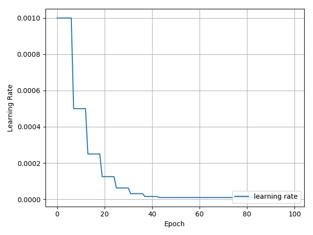

# Cifar-10_PyTorch

Personal practice on CIFAR10 with PyTorch
Inspired by [pytorch-cifar10](https://github.com/icpm/pytorch-cifar10) 

## Result
Models | Best Accuracy | Comments
:---:|:---:|:---:
[AlexNet](https://github.com/zhang-zx/cifar10_pytorch/master/models/AlexNet.py) | 82.18% | BatchNorm and learning rate adjustment is added to make an improvment. 
[ResNet18](https://github.com/zhang-zx/cifar10_pytorch/master/models/ResNet.py) | 89.57% |From the picture, one can tell that this model is convergent before 50 epochs and the rest training is just in vain. :)

## AlexNet

1. Training Procedure 
2. Learning Rate Decay 

## ResNet 18

1. Training Procedure 
2. Learning Rate Decay 
