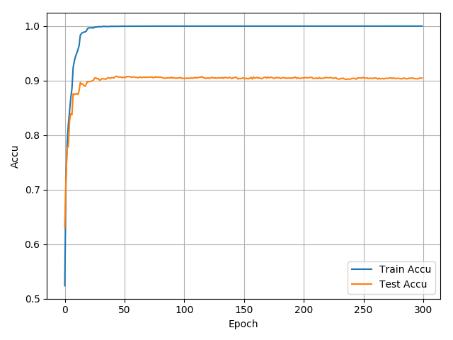

# Cifar-10_PyTorch

Personal paper reading and code implementation.
Inspired by [pytorch-cifar10](https://github.com/icpm/pytorch-cifar10) and the [Solver.py](https://github.com/zhang-zx/cifar10_pytorch/master/Solver.py) is based on `main.py`in [pytorch-cifar10](https://github.com/icpm/pytorch-cifar10) (I take the processing bar code directly into use of course🌝)

## Result
Models | Best Accuracy | Comments
:---:|:---:|:---:
[AlexNet](https://github.com/zhang-zx/cifar10_pytorch/master/models/AlexNet.py) | 82.18% | BatchNorm and learning rate adjustment is added to make an improvment. 
[ResNet18](https://github.com/zhang-zx/cifar10_pytorch/master/models/ResNet.py) | 89.57% |From the picture, one can tell that this model is convergent before 50 epochs and the rest training is just in vain. :) It seems that this ResNet is not as good as expected. Maybe I made something wrong.
[ResNet34](https://github.com/zhang-zx/cifar10_pytorch/master/models/ResNet.py) | 90.81% |Same as ResNet18, such a failure. It's nothing but a waste of time😞. :) I think at most 100 epochs is enough for these ResNet models. The accuracy on training set approched 100% at that time.
[ResNet50](https://github.com/zhang-zx/cifar10_pytorch/master/models/ResNet.py) |--- |---
[ResNet101](https://github.com/zhang-zx/cifar10_pytorch/master/models/ResNet.py) | ---|---
[ResNet152](https://github.com/zhang-zx/cifar10_pytorch/master/models/ResNet.py) | --- |---


## Usage

1. Requirements

```shell
pip install -r requirements.txt
```

2. Run

```shell
python main.py --lr learning_rate --epoch epochs_num --trainBatchSize train_batch_size --testBatchSize test_batch_size --net network
```

3. nohup

```shell
nohup python main.py
```

The log will be in nohup.out, and this line is really useful.

# Training Procedure

## AlexNet

1. **Training Procedure** 


2. **Learning Rate Decay** 


## ResNet 18

1. **Training Procedure** 


2. **Learning Rate Decay** 


## ResNet 34

1. **Training Procedure** 



2. **Learning Rate Decay** 


