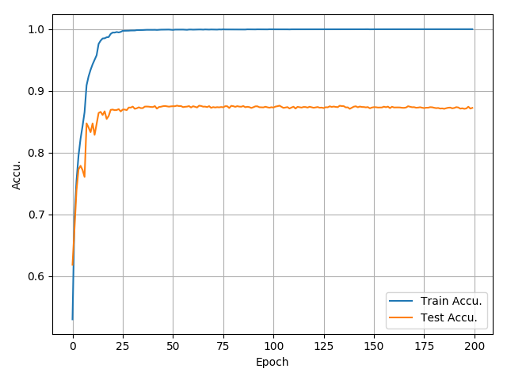
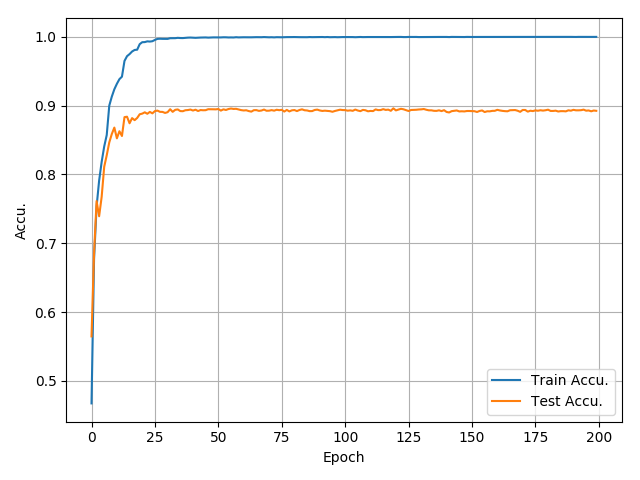

# Cifar-10_PyTorch

Personal paper reading and code implementation.

Inspired by [pytorch-cifar10](https://github.com/icpm/pytorch-cifar10) and the [Solver.py](https://github.com/zhang-zx/cifar10_pytorch/master/Solver.py) is based on `main.py`in [pytorch-cifar10](https://github.com/icpm/pytorch-cifar10) (I take the progress bar code directly into use of course🌝)

## Result
Models | Best Accuracy | Comments
:---:|:---:|:---:
[AlexNet](https://github.com/zhang-zx/cifar10_pytorch/master/models/AlexNet.py) | 82.18% | BatchNorm and learning rate adjustment is added to make an improvment. 
[VGG11](https://github.com/zhang-zx/cifar10_pytorch/master/models/VGGt.py) |87.62% |Just as good as I expected.
[VGG13](https://github.com/zhang-zx/cifar10_pytorch/master/models/VGG.py) |89.43% |The learning rate decay pic is just the same as the one of VGG 11.
[VGG16](https://github.com/zhang-zx/cifar10_pytorch/master/models/VGG.py) |89.61% |Not very impressive.
[VGG19](https://github.com/zhang-zx/cifar10_pytorch/master/models/VGG.py) |88.20% |So bad……...
[ResNet18](https://github.com/zhang-zx/cifar10_pytorch/master/models/ResNet.py) | 89.57% |From the picture, one can tell that this model is convergent before 50 epochs and the rest training is just in vain. :) It seems that this ResNet is not as good as expected. Maybe I made something wrong.
[ResNet34](https://github.com/zhang-zx/cifar10_pytorch/master/models/ResNet.py) | 90.81% |Same as ResNet18, such a failure. It's nothing but a waste of time😞. :) I think at most 100 epochs is enough for these ResNet models. The accuracy on training set approched 100% at that time. Also this one share the same learning rate decay pic with ResNet 18, just as VGG11 & VGG13. I just wonder why?
[ResNet50](https://github.com/zhang-zx/cifar10_pytorch/master/models/ResNet.py) |90.40% |Maybe 50 epochs is enough😞. Not sure why it has worse performance than ResNet 34. Maybe it is due the inappropriate modification on bottleneck blocks...
[ResNet101](https://github.com/zhang-zx/cifar10_pytorch/master/models/ResNet.py) | 89.81% |Maybe something in the code went worng.
[ResNet152](https://github.com/zhang-zx/cifar10_pytorch/master/models/ResNet.py) | 89.97% |At least 5% less than I expected.


## Default Settings

```python 
self.lr = 0.001
self.train_batch_size = 100
self.test_batch_size = 100
self.optimizer = optim.Adam(self.model.parameters(), lr=self.lr)
self.scheduler = optim.lr_scheduler.ReduceLROnPlateau(optimizer=self.optimizer, 
                                                      mode='min', factor=0.5, patience=5, 
                                                      verbose=False, threshold=0.0001, 
                                                      threshold_mode='rel',
                                                      cooldown=0, min_lr=1e-5, eps=1e-08)
self.criterion = nn.CrossEntropyLoss().to(self.device)
```


## Usage

1. Requirements

```shell
pip install -r requirements.txt
```

2. Run

```shell
python main.py --lr learning_rate --epoch epochs_num --trainBatchSize train_batch_size --testBatchSize test_batch_size --net network
```

3. nohup

```shell
nohup python main.py
```

The log will be in nohup.out, and this line is really useful.

# Training Procedure

## AlexNet

1. **Training Procedure** 


2. **Learning Rate Decay** 


## VGG_11

1. **Training Procedure** 



2. **Learning Rate Decay** 


## VGG_13

1. **Training Procedure** 


2. **Learning Rate Decay** 


## VGG_16

1. **Training Procedure** 



2. **Learning Rate Decay** 


## VGG_19

1. **Training Procedure** 


2. **Learning Rate Decay** 


## ResNet 18

1. **Training Procedure** 


2. **Learning Rate Decay** 


## ResNet 34

1. **Training Procedure** 


2. **Learning Rate Decay** 


## ResNet 50

1. **Training Procedure** 


2. **Learning Rate Decay** 


## ResNet 101

1. **Training Procedure** 


2. **Learning Rate Decay** 


## ResNet 152

1. **Training Procedure** 


2. **Learning Rate Decay** 


